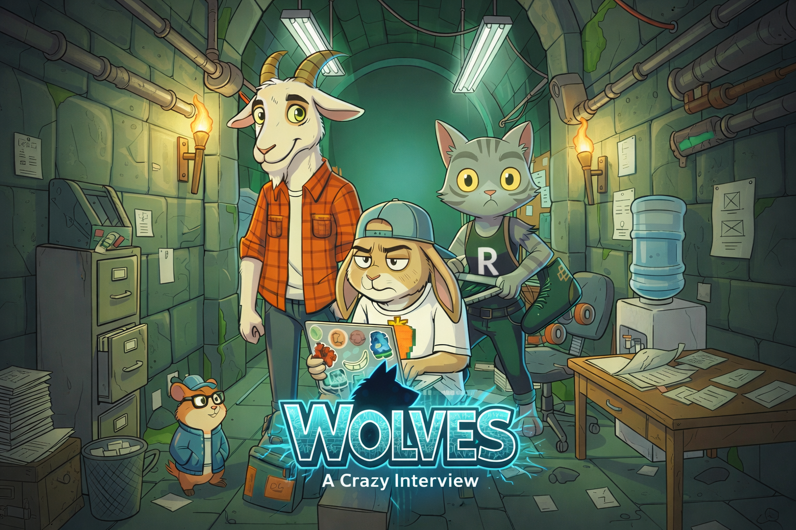

# 🐺 WOLVES – The Interview Game

<p align="center">
  
  
</p>

Backend & Frontend application for **Wolves**, a satirical technical interview game built with **Spring Boot**, **React** and **Vite**.

**Wolves** is a quiz-based game where players face absurd technical interviews conducted by “recruiter wolves”.  
The goal is to practice technical knowledge (starting with Java) in a humorous, narrative-driven, game-like environment.

This project has been developed as an **academic project** within the **IT Academy (2026)**.

---
<p align="center">
  
  
</p>

## 🎯 Project Concept

- Players create an avatar (represented as an animal).
- Each game session simulates a technical job interview.
- Interviews consist of multiple-choice technical questions.
- Based on performance, players:
  - Pass or fail interviews
  - Earn fictional salaries
  - Accumulate results and statistics
  - Climb a global ranking

The tone of the game is **satirical**, inspired by the sometimes absurd nature of real technical interviews.

<p align="center">
  
  
</p>


---

## 🛠️ Tech Stack

### Backend
- **Java 21**
- **Spring Boot**
- **Maven**
- **MongoDB**
- **Spring Security**
- **JWT Authentication**
- **Swagger / OpenAPI**

### Frontend
- **React**
- **Vite**
- **JavaScript**
- **CSS**

---

## 🧩 Domain Overview

### Player
- User registration & login
- Stores statistics:
  - Games played
  - Games passed
  - Total fictional salary earned
  - Failed questions history
- Can play:
  - Normal interview sessions
  - Review sessions (only failed questions)

### Question
- Technical questions (Java-focused)
- Each question includes:
  - Multiple answers
  - One correct option
- Questions are served randomly per game

### Game
- Represents an interview session
- Manages:
  - Question flow
  - Scoring
  - Progress
  - Final result
- Produces:
  - Pass / fail outcome
  - Salary reward
  - Final “wolf message”

### Ranking
- Global ranking based on:
  - Total fictional salary earned

---

## 👥 Roles & Security

### 🐰 Player (ROLE_USER)
- Register & login
- Play interview games
- Play review games (mistakes mode)
- View rankings

### 🐺 Admin – “Wolf Boss” (ROLE_ADMIN)
- Manage players
- Manage questions
- Access administrative endpoints

Role-based authorization is enforced using **Spring Security + JWT**.  
The frontend UI adapts automatically based on the authenticated user role.

<p align="center">
  
  
</p>

### 🏗️ Architecture

The backend is organized using a domain-based (feature-based) architecture, where the code is grouped by business domains instead of technical layers. Each domain contains its own controllers, services, repositories, DTOs, mappers and models.

Conceptually, the project follows the MVC pattern: domain entities represent the Model, REST controllers act as the Controller, and the View is implemented separately in a React frontend. MVC is applied logically rather than through a strict folder structure.

The architecture is inspired by Domain-Driven Design (DDD) principles, but keeps a pragmatic and simplified approach suitable for an academic project, focusing on clarity, maintainability and scalability without unnecessary complexity.

---

## 🖥️ Frontend Details

The frontend is **included in this repository** and built with **React + Vite**.

It is responsible for:
- Game flow visualization
- User interaction
- Animations and transitions
- API communication with the backend

---

## 🎨 Visuals, Audio & AI Usage

- Visual assets, backgrounds and animations were generated using **generative AI tools**.
- Some music tracks and sound effects are used **only as examples**.
- No commercial use is intended.
- The project has **no economic remuneration**.
- All assets are used strictly for **academic and demonstrative purposes**.

---

## 🚀 How to Run the Project Locally

The project is split into **backend** and **frontend**, both included in this repository.

---

### 1️⃣ Backend (Spring Boot API)

**Requirements:**
- Java 21
- Maven
- MongoDB running locally

From the backend root folder:

```bash
cd wolves-api
mvn spring-boot:run

The backend will start on:
http://localhost:8080

Swagger UI:
http://localhost:8080/swagger-ui.html

```


### 2️⃣ Frontend (React + Vite)

Requirements:
	•	Node.js (v18+ recommended)
	•	npm

From the frontend root folder:

```bash
cd wolves-frontend
npm install
npm run dev
```

The frontend will be available at:
http://localhost:5173

### 🧠 Academic Context & Learning Goals

This project was developed in 2026 as part of the IT Academy program.

The focus of the project is:
	•	Backend architecture and clean design
	•	REST API development
	•	Security with JWT & roles
	•	Game logic modeling
	•	AI-assisted frontend generation
	•	Understanding, analyzing and adapting AI-generated code

The goal is learning and comprehension, not production deployment.


⸻

👤 Author

Jordi Casas
IT Academy – 2026

Design, backend development, game logic, API architecture, security
and survival against the wolf.


⸻

📜 License & Usage Notice

This project (Wolves – The Interview Game) is an academic and creative work developed by Jordi Casas.

All source code, game mechanics, narrative concept, characters, dialogues, and audiovisual ideas are original and are protected by copyright.

Usage conditions
	•	❌ Commercial use is NOT allowed
	•	❌ Redistribution of the project or its concept is NOT allowed
	•	❌ Copying the game idea, mechanics, narrative, or structure for another project is NOT allowed
	•	❌ Using this project (or parts of it) as the basis for a commercial or public product is NOT allowed

What is allowed
	•	✅ Viewing the code for educational purposes
	•	✅ Running the project locally to explore its architecture and functionality
	•	✅ Studying the implementation as a learning reference

Any use beyond educational or personal learning purposes requires explicit written permission from the author.

⸻

Intellectual Property

This repository contains:
	•	Original game concept and mechanics
	•	Custom narrative content and dialogues
	•	Backend and frontend architecture
	•	Generated audiovisual assets (used for academic/demo purposes only)

The project is not intended for commercial use at this stage.
Some audiovisual assets and audio tracks are used as examples only and remain the property of their respective owners.

⸻

© 2026 — Jordi Casas
Academic project developed at IT Academy

